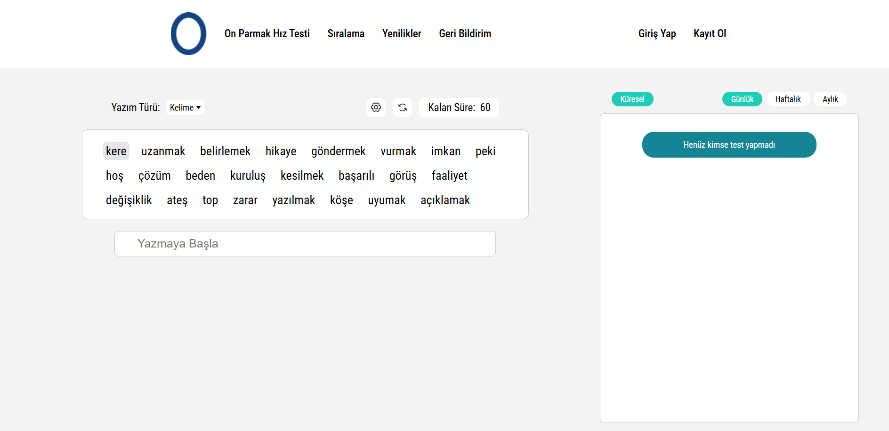

# OptiSpeedKeys - On Parmak Hız Testi

Merhaba! Bu repository, benim tarafımdan geliştirilen **OptiSpeedKeys - On Parmak Hız Testi** web sitesini sergilemek amacıyla oluşturulmuştur.

Web sitesi, kullanıcıların on parmak klavye yazma hızlarını ölçmelerine, pratik yapmalarına ve gelişimlerini takip etmelerine olanak tanır.

---

## 🚀 Canlı Siteye Git!

Projeyi canlı olarak deneyimlemek ve hızınızı test etmek için aşağıdaki bağlantıya tıklayabilirsiniz:

**➡️ [https://www.optispeedkeys.com/tr/on-parmak-hiz-testi/](https://www.optispeedkeys.com/tr/on-parmak-hiz-testi/) ⬅️**

---

## 🖼️ Ekran Görüntüsü

Aşağıda web sitesinden bir ekran görüntüsünü görebilirsiniz:

 

---

## 🛠️ Kullanılan Teknolojiler (Genel Bakış)

Bu proje geliştirilirken başlıca aşağıdaki teknolojiler kullanılmıştır:

*   PHP
*   HTML5
*   CSS3
*   JavaScript
*   MySQL

---

## 👨‍💻 Geliştirici

Bu proje **Miraç Sucu** tarafından geliştirilmiştir.

*   **GitHub:** miracsucu4417
*   **LinkedIn:** [`[LinkedIn Profil Linkin (varsa)]`](https://www.linkedin.com/in/mira%C3%A7-sucu-9b383733a/)

---

Bu repository, projenin kaynak kodlarını içermemektedir. Amacı, geliştirdiğim bu web sitesini portfolyomun bir parçası olarak sunmaktır.
